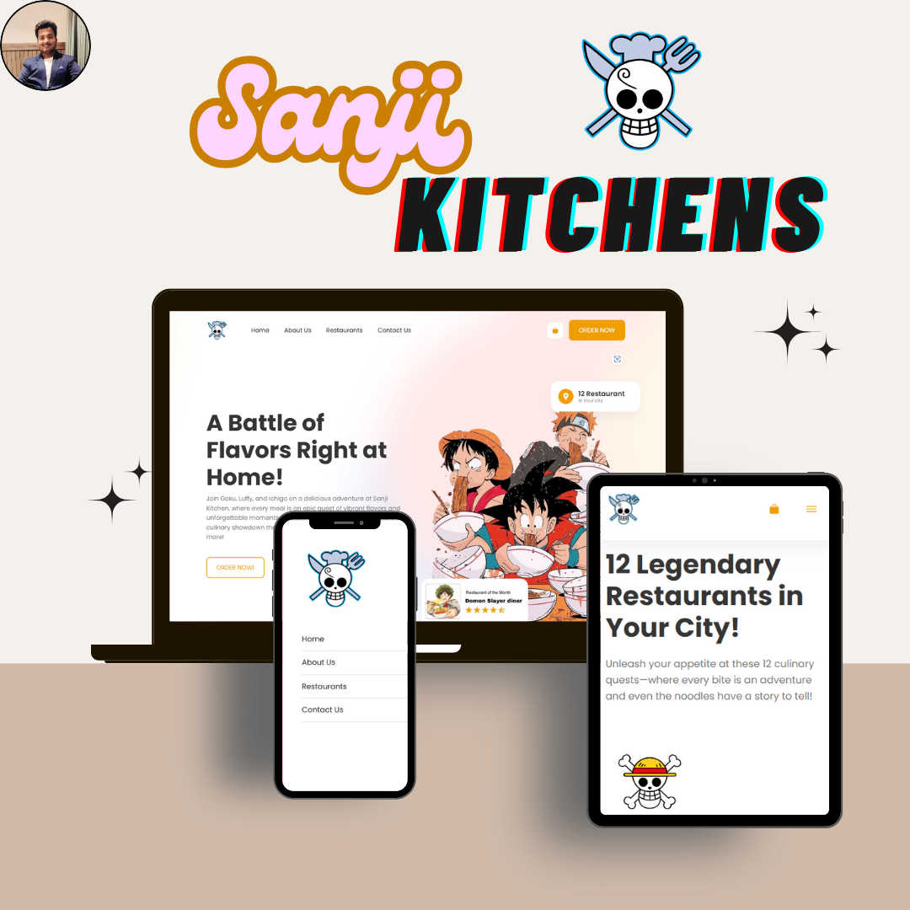

# 🍜 **Sanji Kitchen - Anime-Themed Food Delivery Website**

Welcome to **Sanji Kitchen**, where your favorite anime heroes serve up a battle of flavors! This project is a visually engaging and responsive food delivery website that brings anime magic to your table. Built using **HTML**, **CSS**, and **JavaScript**, it offers an exciting culinary adventure across all devices—desktop, tablet, and mobile. 🎉

## 🌍 **Live Preview**

Experience the full website:  
[Sanji Kitchen - Live Demo](https://sanjikitchens.netlify.app/)

## 📱 **Responsive Views**

Here’s how the site looks across different devices:
- **Desktop View**  
- **Tablet View**  
- **Mobile View**

 

## ✨ **Features**

- 🍣 **Anime-Inspired Design**: Join Goku, Luffy, and Ichigo for an adventure in flavors.
- 🖥️ **Responsive Layout**: Fully optimized for **desktop**, **tablet**, and **mobile**.
- 📦 **Interactive Ordering System**: Select restaurants, menus, and track your food adventure.
- 🚀 **Quick Delivery**: Embark on a tasty quest, and have your meal delivered by anime heroes!

## 🛠️ **Technologies Used**

- 🟠 **HTML5**: Structured content for a seamless user experience.
- 🔵 **CSS3**: Custom styling and responsive design.
- 🟢 **JavaScript**: Interactive elements and ordering process.
- 🌐 **Netlify**: Live deployment for easy access.

## 🚀 **How It Works**

1. **Select a Restaurant**: Choose from 12 legendary anime-themed restaurants.
2. **Choose Your Menu**: Dive into a wide variety of flavorful dishes.
3. **Wait for Delivery**: Your food, delivered by anime characters straight to your door!

## 📬 **Contact Me**

Got feedback or questions? Feel free to reach out!  
Visit my portfolio: [Gopi Chakradhar Portfolio](https://mgopiportfolios.netlify.app/)

---

✨ Built with passion and creativity by [Gopi Chakradhar](https://github.com/Gopi1603) ✨
